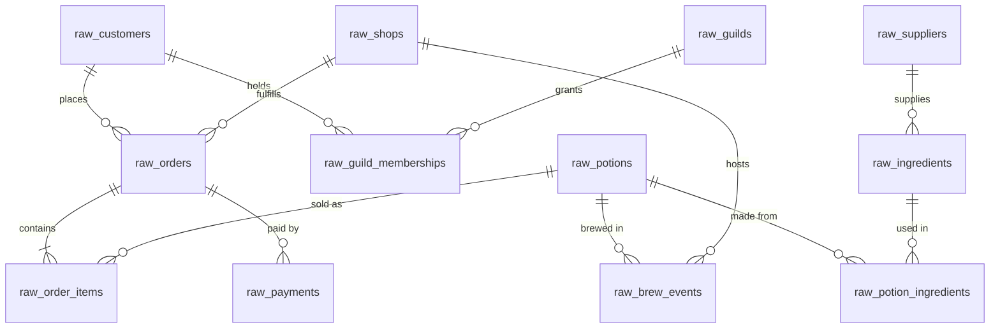

# 🧙‍♀️✨🌿 Merlin & Co. Apothecaries — raw source data

Wizard-themed, jaffle-shop-style raw source data. These CSVs are the dbt **seeds** that stand in for raw warehouse tables; the lab's dbt project builds staging → intermediate → marts on top of them.

**The business:** Merlin & Co. Apothecaries is a 15-shop potion retail chain spanning five regions. Wizards (customers) buy potions in store, by courier owl, or via a marketplace. Shops brew their own stock from ingredients sourced from regional suppliers, and many customers belong to arcane guilds with tiered memberships.

## Repo layout & size tiers

```
scripts/
├── generate_data.py     # deterministic CSV generator (--size medium|large)
└── export_parquet.py    # large_data → parquet mirrors + one shareable denormalized file
seeds/
├── medium_data/         # lab default: ~15k orders / ~51k order items / 5k customers (~7 MB)
├── large_data/          # ~75k orders / ~253k order items / 20k customers (~25 MB)
└── parquet_data/        # parquet exports of large_data (~7.5 MB total)
docs/
├── ERD.md               # full schema diagram with every column, type, and PK/FK marker
└── DATA_DICTIONARY.md   # per-table column notes and deliberate data quirks
```

> **dbt note:** point `seed-paths` at exactly **one** tier (e.g. `seeds/medium_data`). Both tiers use identical filenames, so including both would give dbt duplicate seed names.

`seeds/parquet_data/` contains a byte-faithful parquet mirror of each large raw table (read all-varchar) **plus** `merlin_large_denormalized.parquet` — a single shareable file at order-item grain (~253k rows, 4.3 MB) with orders, customers, shops, and potions joined in and proper types.

## Source systems

The 12 tables come from three fictional source systems:

| Folder | System | Tables |
|---|---|---|
| `<tier>/abra_pos/` | **Abracadabra POS** (point-of-sale) | `raw_potions`, `raw_orders`, `raw_order_items`, `raw_payments` |
| `<tier>/grimoire_crm/` | **Grimoire CRM** | `raw_customers`, `raw_guilds`, `raw_guild_memberships` |
| `<tier>/alembic_ops/` | **Alembic Ops** (production & procurement) | `raw_shops`, `raw_suppliers`, `raw_ingredients`, `raw_potion_ingredients`, `raw_brew_events` |

## ERD

See **[docs/ERD.md](docs/ERD.md)** for the full schema diagram. Quick relationship overview:



## Intended downstream models (Kimball)

| Layer | Models |
|---|---|
| staging | one `stg_` model per raw table (rename, recast, normalize case, conform regions, copper → gold) |
| intermediate | e.g. `int_orders_with_payments`, `int_potion_supply_cost`, `int_memberships_current` |
| dims | `dim_wizards` (customers + current guild/tier), `dim_potions`, `dim_shops`, `dim_suppliers`, `dim_dates` |
| facts | `fct_orders` (order grain), `fct_order_items` (line grain), `fct_payments`, `fct_brews` |

## Built-in storylines

- **Growth**: order volume roughly doubles across the two-year window (2024-07 → 2026-06)
- **Seasonality**: Healing spikes in winter, Love potions ~2× share in February, Luck around the new year
- **Regional spread**: wizard populations differ by region (~1.8× revenue spread top to bottom)
- **Whales**: customer order counts follow a power-law — a few archmages drive outsized revenue
- **Home-region loyalty**: 80% of orders happen in the customer's home region

## Regenerating the data

```bash
uv run scripts/generate_data.py --size medium   # → seeds/medium_data/
uv run scripts/generate_data.py --size large    # → seeds/large_data/
uv run scripts/export_parquet.py                # large_data → seeds/parquet_data/
```

The generator is stdlib-only and fully deterministic (seeded RNG) — re-running produces byte-identical CSVs. See **[docs/DATA_DICTIONARY.md](docs/DATA_DICTIONARY.md)** for column-level details and deliberate data quirks.
