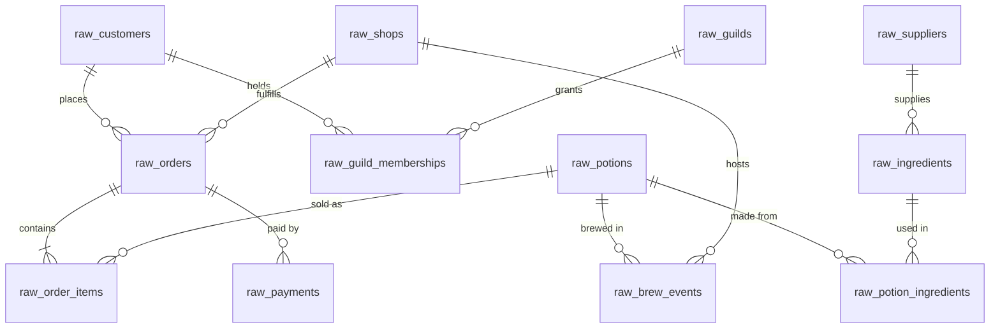

# 🧙‍♀️✨🌿 Merlin & Co. Apothecaries

Wizard-themed, jaffle-shop-style dbt project for the dbt Summit training
**"Governed & Scalable AI-assisted Analytics with dbt."** Workshop raw source
relations are pre-built in Snowflake, and the project builds staging → intermediate
→ marts on top with dbt Fusion. Committed seeds preserve project portability for
facilitator setup and reuse in other training environments.

The project is built out ~90% as a **governed reference project** (contracts, tests,
a semantic layer, conventions, and CI). One complete `source → mart` vertical — the
`alembic_ops` procurement / supply-cost slice — is deliberately left **unbuilt**.
Trainees build it twice: first as a minimally governed baseline under `models/warlock/`,
then as a governed implementation under `models/wizard/`. The completed starter-state
models remain untouched.

**New here?** Read [AGENTS.md](AGENTS.md) and
[docs/merlinco/STYLE_GUIDE.md](docs/merlinco/STYLE_GUIDE.md) first.


## Workshop quickstart

The workshop environment already contains the raw source relations. Trainees do not
need to load seeds.

```bash
dbt deps                     # install dbt_utils
dbt parse                    # validate the project (no warehouse needed)
dbt build                    # run + test models against your Snowflake connection
```

Staging reads the pre-built raw tables through `source()` declarations in
`models/staging/<system>/_<system>__sources.yml`. Facilitators setting up the project
in a new Snowflake environment can use the committed seeds to provision those raw
relations before the workshop.

Local development requires a Snowflake connection profile; in dbt Platform the
connection is managed in the environment settings.

**The business:** Merlin & Co. Apothecaries is a 15-shop potion retail chain spanning five regions. Wizards (customers) buy potions in store, by courier owl, or via a marketplace. Shops brew their own stock from ingredients sourced from regional suppliers, and many customers belong to arcane guilds with tiered memberships.

## Repo layout

```text
models/
├── staging/          # completed source-facing models and source declarations
├── intermediate/     # completed join, fanout, and aggregation patterns
├── marts/            # completed contracted marts and semantic definitions
├── warlock/          # trainee baseline: staging/intermediate/marts
├── wizard/           # trainee governed build: staging/intermediate/marts
└── answer_key/       # disabled facilitator comparison models
macros/               # shared cleaning macros (to_boolean, copper_to_gold, conform_region, …)
seeds/medium_data/    # portable raw CSV fixtures for facilitator/environment setup

ci/                   # dummy profile for warehouse-free CI examples
docs/merlinco/
├── ERD.md                     # full schema diagram (columns, types, PK/FK markers)
├── DATA_DICTIONARY.md         # per-table column notes and deliberate data quirks
└── STYLE_GUIDE.md             # modeling + naming conventions
```

The Warlock track uses `__warlock` node-name suffixes to avoid collisions. The Wizard
track uses the canonical target names. Both tracks use the project’s standard `staging`
and `marts` schemas; their distinct relation names allow them to coexist.


The `medium_data` tier (~15k orders / ~51k order items / 5k customers) is the lab default
and the only tier `seed-paths` points at.

## Source systems

The 12 tables come from three fictional source systems:

| Folder | System | Tables |
|---|---|---|
| `seeds/medium_data/abra_pos/` | **Abracadabra POS** (point-of-sale) | `raw_potions`, `raw_orders`, `raw_order_items`, `raw_payments` |
| `seeds/medium_data/grimoire_crm/` | **Grimoire CRM** | `raw_customers`, `raw_guilds`, `raw_guild_memberships` |
| `seeds/medium_data/alembic_ops/` | **Alembic Ops** (production & procurement) | `raw_shops`, `raw_suppliers`, `raw_ingredients`, `raw_potion_ingredients`, `raw_brew_events` |

## ERD

See **[docs/merlinco/ERD.md](docs/merlinco/ERD.md)** for the full schema diagram. Quick relationship overview:




## Downstream models (Kimball)

Built out today (hero path) vs. left for the hands-on procurement lab:

| Layer | Built | Lab (unbuilt) |
|---|---|---|
| staging | `stg_` for potions, orders, order_items, payments, customers, guilds, guild_memberships, shops | suppliers, ingredients, potion_ingredients, brew_events |
| intermediate | `int_customers_with_current_membership`, `int_memberships_current`, `int_order_items_with_order_context`, `int_orders_with_payments`, `int_payments_with_order_context` | `int_potion_supply_cost`, `int_brews_with_supply_cost` |
| dims | `dim_wizards`, `dim_potions`, `dim_shops`, `dim_dates` | `dim_suppliers` |
| facts | `fct_orders`, `fct_order_items`, `fct_payments` | `fct_brews` |

Staging normalizes the deliberate raw quirks via shared macros (`to_boolean`,
`copper_to_gold`, `conform_region` in [macros/](macros/)) plus direct casts and
lightweight cleanup in the staging models. Marts carry enforced contracts + tests,
and a semantic layer defines the governed metrics.

## Built-in storylines

- **Growth**: order volume roughly doubles across the two-year window (2024-07 → 2026-06)
- **Seasonality**: Healing spikes in winter, Love potions ~2× share in February, Luck around the new year
- **Regional spread**: wizard populations differ by region (~1.8× revenue spread top to bottom)
- **Whales**: customer order counts follow a power-law — a few archmages drive outsized revenue
- **Home-region loyalty**: 80% of orders happen in the customer's home region

## Where the data comes from

The 12 raw CSVs in `seeds/medium_data/` are committed as portable setup fixtures; the
workshop itself uses pre-built raw relations. The fixtures were produced by a deterministic,
stdlib-only generator (seeded RNG, so output is byte-identical on every run) that lives
outside this training repo. See **[docs/merlinco/DATA_DICTIONARY.md](docs/merlinco/DATA_DICTIONARY.md)** for
column-level details and the deliberate data quirks staging is built to clean up.


