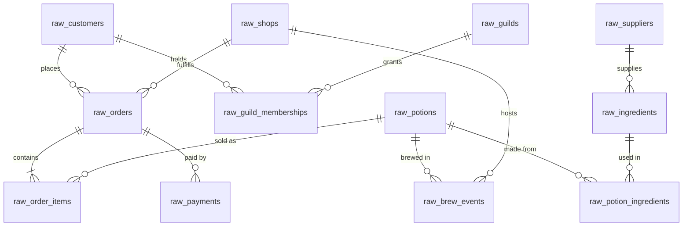

# 🧙 Merlin & Co. Apothecaries — raw source data

Wizard-themed, jaffle-shop-style raw source data. These CSVs are the dbt **seeds** that stand in for raw warehouse tables; the lab's dbt project builds staging → intermediate → marts on top of them.

**The business:** Merlin & Co. Apothecaries is a 15-shop potion retail chain spanning five regions. Wizards (customers) buy potions in store, by courier owl, or via a marketplace. Shops brew their own stock from ingredients sourced from regional suppliers, and many customers belong to arcane guilds with tiered memberships.

## Repo layout & size tiers

```
scripts/
├── generate_data.py     # deterministic CSV generator (--size medium|large)
└── export_parquet.py    # large_data → parquet mirrors + one shareable denormalized file
seeds/
├── medium_data/         # lab default: ~15k orders / ~51k order items / 5k customers (~7 MB)
├── large_data/          # ~75k orders / ~253k order items / 20k customers (~25 MB)
└── parquet_data/        # parquet exports of large_data (~7.5 MB total)
```

> **dbt note:** point `seed-paths` at exactly **one** tier (e.g. `seeds/medium_data`). Both tiers use identical filenames, so including both would give dbt duplicate seed names.

`seeds/parquet_data/` contains a byte-faithful parquet mirror of each large raw table (read all-varchar, so every raw quirk survives verbatim) **plus** `merlin_large_denormalized.parquet` — a single shareable file at order-item grain (~253k rows, 4.3 MB) with orders, customers, shops, and potions joined in and proper types, ideal for handing to someone for inspection.

## Source systems

The 12 tables come from three fictional source systems — organized as subfolders within each size tier so they map cleanly to dbt `sources`:

| Folder | System | Tables |
|---|---|---|
| `<tier>/abra_pos/` | **Abracadabra POS** (point-of-sale) | `raw_potions`, `raw_orders`, `raw_order_items`, `raw_payments` |
| `<tier>/grimoire_crm/` | **Grimoire CRM** | `raw_customers`, `raw_guilds`, `raw_guild_memberships` |
| `<tier>/alembic_ops/` | **Alembic Ops** (production & procurement) | `raw_shops`, `raw_suppliers`, `raw_ingredients`, `raw_potion_ingredients`, `raw_brew_events` |

## ERD

Relationship overview below — see **[ERD.md](ERD.md)** for the full schema-level diagram with every column, type, and PK/FK marker.



## Data dictionary

### `abra_pos/raw_orders` (~15k rows medium / ~75k large)

| Column | Notes |
|---|---|
| `order_id` | PK, `ORD-000001` |
| `customer_id` | FK → `raw_customers` |
| `shop_id` | FK → `raw_shops` |
| `ordered_at` | ⚠️ two formats: `2024-07-01T16:20:32Z` and `2024-07-01 14:58:46` |
| `status` | ⚠️ mixed case: `completed` / `Completed` / `COMPLETED`; values: completed (~93%), returned, cancelled, placed (recent only) |
| `channel` | `in_store`, `courier_owl`, `marketplace` |
| `discount_copper` | order-level discount, 0 for ~90% of orders |

### `abra_pos/raw_order_items` (~51k rows medium / ~253k large)

| Column | Notes |
|---|---|
| `order_item_id` | PK, `ITM-000001` |
| `order_id` | FK → `raw_orders`; every order has ≥1 item |
| `potion_sku` | FK → `raw_potions`; no repeated SKU within one order |
| `quantity` | 1–5, skewed to 1 |
| `unit_price_copper` | price **at time of sale** — drifts ±5% around base price and inflates ~8% across the window |

### `abra_pos/raw_payments` (~17k rows medium / ~86k large)

| Column | Notes |
|---|---|
| `payment_id` | PK, `PAY-000001` |
| `order_id` | FK → `raw_orders`; ~8% of larger orders split across two payments, ~5% have a `failed` attempt before a `success` |
| `method` | `coin`, `guild_credit`, `crystal_transfer`, `barter` |
| `amount_copper` | successful payments sum exactly to order total (items − discount) |
| `status` | `success`, `failed`, `refunded` (returned orders get a refund row) |
| `paid_at` | ⚠️ mixed timestamp formats |

### `abra_pos/raw_potions` (120 rows)

| Column | Notes |
|---|---|
| `potion_sku` | PK, `POT-0001` |
| `potion_name` | e.g. *Elixir of Focused Mind*, *Draught of Fortunate Turns* |
| `category` | ⚠️ mixed case; Healing, Clarity, Luck, Strength, Invisibility, Love |
| `base_price_copper` | list price in copper pieces (100 copper = 1 gold crown) |
| `potency` | 1–10 |
| `shelf_life_days` | 14–365 |
| `is_regulated` | ⚠️ messy boolean: `Y`/`N`/`yes`/`no`/`TRUE`/`FALSE` |
| `introduced_at` | ~30% launch mid-window (new-product storylines) |

### `grimoire_crm/raw_customers` (5k rows medium / 20k large)

| Column | Notes |
|---|---|
| `customer_id` | PK, `WIZ-00001` |
| `full_name` | generated wizard names |
| `email` | ⚠️ ~2% null |
| `home_region` | ⚠️ inconsistent coding: `NR` / `nr` / `Northern Reaches` / `northern reaches` — needs a region mapping in staging to conform with `raw_shops.region` |
| `signed_up_at` | 2023-01 onward; orders never precede signup |
| `birth_year` | 1885–2007 (wizards age gracefully) |
| `favored_discipline` | ⚠️ mixed case; Healing, Divination, Alchemy, … |

### `grimoire_crm/raw_guilds` (12 rows) & `raw_guild_memberships` (~3.6k rows medium / ~14.5k large)

Memberships are SCD2-shaped: `valid_from` / `valid_to` (empty = current), with ~30% of promoted members carrying a closed row at their prior `tier` (⚠️ mixed case: apprentice / Adept / ARCHMAGE). ~65% of customers belong to a guild.

### `alembic_ops/raw_shops` (15 rows)

`shop_id`, `shop_name` (*The Gilded Alembic*, *Moonpetal & Mortar*, …), `city`, `region`, `opened_at`. **`region` is the clean, canonical spelling** — five values: Northern Reaches, Ember Coast, Silverwood, The Marshlands, Crystal Vale. Three shops per region.

### `alembic_ops/raw_suppliers` (15), `raw_ingredients` (80), `raw_potion_ingredients` (~400)

Suppliers → ingredients → recipe bridge. `raw_potion_ingredients` maps each potion to 2–5 ingredients with quantities — the join path for supply-cost and blast-radius analyses. ⚠️ `unit` has mixed casing in both ingredient and recipe tables.

### `alembic_ops/raw_brew_events` (8k rows medium / 40k large)

Batch-level production log: `brew_id`, `potion_sku`, `shop_id`, `cauldron_id`, `brewed_at`, `batch_size`, `brew_duration_minutes` (⚠️ ~1% null), `quality_check` (⚠️ mixed case pass/fail, ~7% fail), `brewer_name`.

## Deliberate data quirks (staging-layer work)

The data is *lightly messy* — referential integrity is intact everywhere (no orphaned FKs, no duplicate PKs), but staging models have real work to do:

1. **Mixed-case categoricals** — `status`, `category`, `tier`, `unit`, `quality_check`, `favored_discipline` need `lower()` normalization
2. **Two timestamp formats** — ISO-with-Z and space-separated, in every `*_at` timestamp column
3. **Inconsistent region coding** — CRM `home_region` uses four spellings; ops `region` is canonical. Conforming them is the classic staging exercise
4. **Messy booleans** — `is_regulated`, `is_hazardous`: `Y`/`N`/`yes`/`no`/`TRUE`/`FALSE`
5. **Copper-piece integer prices** — cents-style; convert to gold crowns (`/ 100.0`) in staging
6. **Sparse nulls** — ~2% customer emails, ~1% brew durations, `valid_to` empty on current memberships

## Built-in storylines (why the numbers are demo-worthy)

- **Growth**: order volume roughly doubles across the two-year window (2024-07 → 2026-06), so time-series charts slope upward
- **Seasonality**: Healing spikes in winter, **Love potions ~2× share in February**, Luck around the new year, Clarity in exam season (Sep–Oct), Invisibility in October
- **Regional spread**: wizard populations differ by region (Northern Reaches ≈ 2× Crystal Vale), so *revenue by region* has a real structural spread (~1.8× top to bottom) — not just sampling noise
- **Regional taste**: each region also over-indexes on 1–2 potion categories, so *category mix by region* varies
- **Whales**: customer order counts follow a power-law — a few archmages drive outsized revenue
- **Home-region loyalty**: 80% of orders happen in the customer's home region

## Intended downstream models (Kimball)

| Layer | Models |
|---|---|
| staging | one `stg_` model per raw table (rename, recast, normalize case, conform regions, copper → gold) |
| intermediate | e.g. `int_orders_with_payments`, `int_potion_supply_cost`, `int_memberships_current` |
| dims | `dim_wizards` (customers + current guild/tier), `dim_potions`, `dim_shops`, `dim_suppliers`, `dim_dates` |
| facts | `fct_orders` (order grain), `fct_order_items` (line grain), `fct_payments`, `fct_brews` |

**Lab mapping:** `fct_orders` — the "broken revenue dashboard" model in the Lesson 3 scenario — comes from `raw_orders` + `raw_order_items` (+ `raw_payments`), with *revenue by region* reaching the Semantic Layer via `raw_orders.shop_id → raw_shops.region`. Good blast-radius lineage chains: `raw_orders → stg_orders → int_orders_with_payments → fct_orders → {revenue dashboard, dim_wizards LTV}`, and `raw_suppliers → raw_ingredients → raw_potion_ingredients → potion margin models`.

## Regenerating the data

```bash
uv run scripts/generate_data.py --size medium   # → seeds/medium_data/
uv run scripts/generate_data.py --size large    # → seeds/large_data/
uv run scripts/export_parquet.py                # large_data → seeds/parquet_data/
```

The generator is stdlib-only and fully deterministic (seeded RNG) — re-running a tier produces byte-identical CSVs. To resize or reshape, edit the constants at the top of `scripts/generate_data.py` (`SIZES`, `WINDOW_START/END`, seasonality and region tables, …) and re-run. It validates before writing: unique PKs, resolved FKs, payments reconcile to order totals, all dates in window. The parquet export (`scripts/export_parquet.py`, needs only `uv` — it pulls duckdb itself) rebuilds the per-table mirrors and the denormalized share file from whatever is in `seeds/large_data/`.
