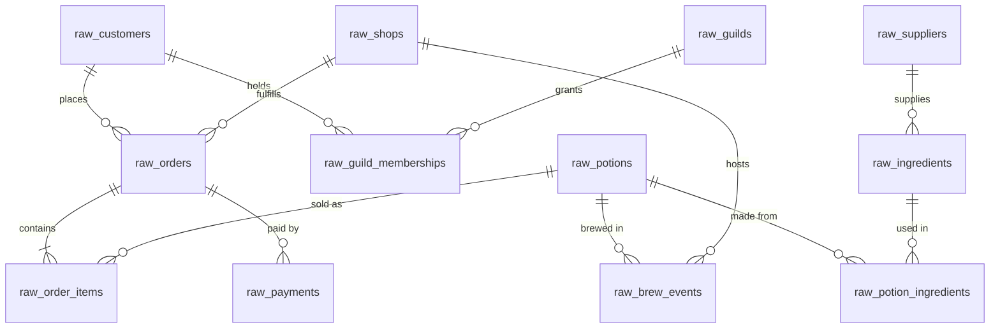

# 🧙‍♀️✨🌿 Merlin & Co. Apothecaries

Wizard-themed, jaffle-shop-style dbt project for the dbt Summit training
**"Governed & Scalable AI-assisted Analytics with dbt."** Raw source data lands as
dbt **seeds** (standing in for raw warehouse tables) and the project builds
staging → intermediate → marts on top, on **Snowflake**, Fusion-aligned.

The project is built out ~90% as a **governed reference project** (contracts, tests,
a semantic layer, conventions, and CI). One complete `source → mart` vertical — the
`alembic_ops` procurement / supply-cost slice — is deliberately left **unbuilt** as a
hands-on "plan → design → build with AI" lab. See
[docs/LAB_procurement_slice.md](docs/LAB_procurement_slice.md).

**New here?** Read [CLAUDE.md](CLAUDE.md) (conventions / AI guardrails) and
[docs/STYLE_GUIDE.md](docs/STYLE_GUIDE.md) first.

## Quickstart

```bash
dbt deps                     # install dbt_utils
dbt parse                    # validate the project (no warehouse needed)
dbt seed                     # load raw CSVs into the <schema>_raw landing zone (run once)
dbt build                    # run + test all models against your Snowflake connection
```

Staging reads the raw tables via `source()` (declared in
`models/staging/<system>/_<system>__sources.yml`); the seeds populate those source
tables. dbt doesn't link a seed to its source, so **`dbt seed` before `dbt build`** —
the data is static, so it's a one-time step.

Local dev needs a `~/.dbt/profiles.yml` (copy [profiles.example.yml](profiles.example.yml));
once the repo is linked to the dbt platform, the connection is managed there instead.

**The business:** Merlin & Co. Apothecaries is a 15-shop potion retail chain spanning five regions. Wizards (customers) buy potions in store, by courier owl, or via a marketplace. Shops brew their own stock from ingredients sourced from regional suppliers, and many customers belong to arcane guilds with tiered memberships.

## Repo layout

```
models/
├── staging/          # stg_<system>__<entity> — clean + type, reads one source()
│   └── <system>/     #   + _<system>__sources.yml (raw tables declared as dbt sources)
├── intermediate/     # int_ models — joins, fan-out, aggregation
└── marts/            # dim_ / fct_ + enforced contracts, tests, and the semantic layer
macros/               # shared cleaning macros (parse_dual_timestamp, to_boolean, …)
seeds/medium_data/    # the 12 raw CSVs (3 source systems); `dbt seed` loads them
ci/                   # dummy profile for warehouse-free CI (parse + lint)
docs/
├── ERD.md                     # full schema diagram (columns, types, PK/FK markers)
├── DATA_DICTIONARY.md         # per-table column notes and deliberate data quirks
├── STYLE_GUIDE.md             # modeling + naming conventions
└── LAB_procurement_slice.md   # brief for the hands-on build-with-AI lab
```

The `medium_data` tier (~15k orders / ~51k order items / 5k customers) is the lab default
and the only tier `seed-paths` points at.

## Source systems

The 12 tables come from three fictional source systems:

| Folder | System | Tables |
|---|---|---|
| `seeds/medium_data/abra_pos/` | **Abracadabra POS** (point-of-sale) | `raw_potions`, `raw_orders`, `raw_order_items`, `raw_payments` |
| `seeds/medium_data/grimoire_crm/` | **Grimoire CRM** | `raw_customers`, `raw_guilds`, `raw_guild_memberships` |
| `seeds/medium_data/alembic_ops/` | **Alembic Ops** (production & procurement) | `raw_shops`, `raw_suppliers`, `raw_ingredients`, `raw_potion_ingredients`, `raw_brew_events` |

## ERD

See **[docs/ERD.md](docs/ERD.md)** for the full schema diagram. Quick relationship overview:



## Downstream models (Kimball)

Built out today (hero path) vs. left for the hands-on procurement lab:

| Layer | Built | Lab (unbuilt) |
|---|---|---|
| staging | `stg_` for potions, orders, order_items, payments, customers, guilds, guild_memberships, shops | suppliers, ingredients, potion_ingredients, brew_events |
| intermediate | `int_orders_with_payments`, `int_memberships_current` | `int_potion_supply_cost` |
| dims | `dim_wizards`, `dim_potions`, `dim_shops`, `dim_dates` | `dim_suppliers` |
| facts | `fct_orders`, `fct_order_items`, `fct_payments` | `fct_brews` |

Staging normalizes the deliberate raw quirks via shared macros (`parse_dual_timestamp`,
`to_boolean`, `copper_to_gold`, `conform_region` in [macros/](macros/)). Marts carry
enforced contracts + tests, and a semantic layer defines the governed metrics.

## Built-in storylines

- **Growth**: order volume roughly doubles across the two-year window (2024-07 → 2026-06)
- **Seasonality**: Healing spikes in winter, Love potions ~2× share in February, Luck around the new year
- **Regional spread**: wizard populations differ by region (~1.8× revenue spread top to bottom)
- **Whales**: customer order counts follow a power-law — a few archmages drive outsized revenue
- **Home-region loyalty**: 80% of orders happen in the customer's home region

## Where the data comes from

The 12 raw CSVs in `seeds/medium_data/` are committed and ready to `dbt seed` — no
generation step is needed to use this repo. They were produced by a deterministic,
stdlib-only generator (seeded RNG, so output is byte-identical on every run) that lives
outside this training repo. See **[docs/DATA_DICTIONARY.md](docs/DATA_DICTIONARY.md)** for
column-level details and the deliberate data quirks staging is built to clean up.
